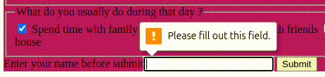

# LAB: My Recipe

**HTML - Week 2**

In this lab you will fix a html file.  
Let's pretend that you are helping a student that followed instructions. Your role is to resolve the isssue they are facing.

By the end of the lab you should have an index.html that looks like this in the browser:  


⚠️ Please read the plan before starting the lab.

1. Fork the repository, and clone
2. Install Live Server extension in VS code
3. Do every exercice in their own branches
4. Merge all of your work in a newly created branch and publish

Good luck and have fun building your recipe page! 🍽️

## 1. Fork this repository, clone, and open in VS code

To get started with the lab, you need to fork the repository:

1. Click on the **Fork** button at the top-right corner of the repository page.


3. Clone your new forked repository on your laptop
   2 ways possible to clone:
   - Clone with VS code (without line command):
       
   - Clone using the git clone command:
       

<!-- ## 2. New Tool: Live Server + VS Code

For this lab, we will use the **Live Server** extension in VS Code to preview our HTML changes in real time.

### What is Live Server?

Live Server is a **VS Code extension** that allows you to launch a local development server with **auto-refresh** whenever you save changes to your HTML file.

### How to Install & Use Live Server

1. Open **VS Code**.
2. Go to **Extensions** (Ctrl+Shift+X or Cmd+Shift+X on Mac).
3. Search for **Live Server** and install it.
4. Open your **HTML file** in VS Code.
5. Right-click and select **"Open with Live Server"**, OR click on the **"Go Live"** button in the status bar.
6. Your browser will open with the live preview of your file.
   -->

---

## 3. Exercices

In order for the index.html to be fully fixed, it needs to respond to theses requirements:

**Page setup:**  
1. Have a title for the page's tab


2. Put a title at the top of the document (highest level)
  

**Now every instructions will consist of a section, with a title (second level), and the expected content:** 

3. Make a plan of a week's day:
- second level title
- content:
    - x-level heading: days of the weeks
        - (x-1)-level title for each days
  

:warning The goal here is to use the correct heading levels. You must choose the levels considering the entire page, from the page title to the smallest titles. 

4. Have two images  
- one that comes from an external url
- one that comes from the local /assets 
 

5. Make an ordered and unordered list
 

6. Have two links  
- one that redirects to the url, **staying on the same tab**
- one that will open the url's page **in a new tab** 
 

7. Have a form, with radio buttons, checkboxes, and text input:
 
- 2 radio buttons named "favourite-day"
    - you should be able to choose only one option  
     
- a set of checkboxes named "activities"
    - the result page should be capale of listing all selected options  
    - select all options to make sure it works as it should
     
- a required text field (you should not be able to submit without filling 
it)  
     


## 4. Publish your work

When you are satified, just commit and push:
   ```bash
   git add .
   git commit 
   git push
   ```

   
🥳 Yeaaaaah !!!! You've reached the end of the lab :)


